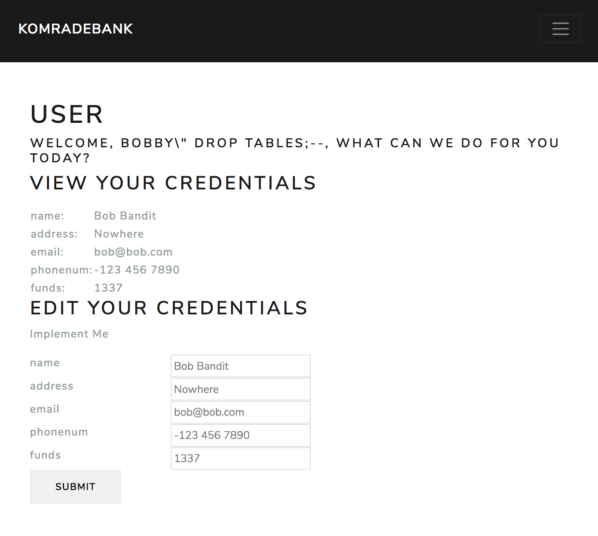
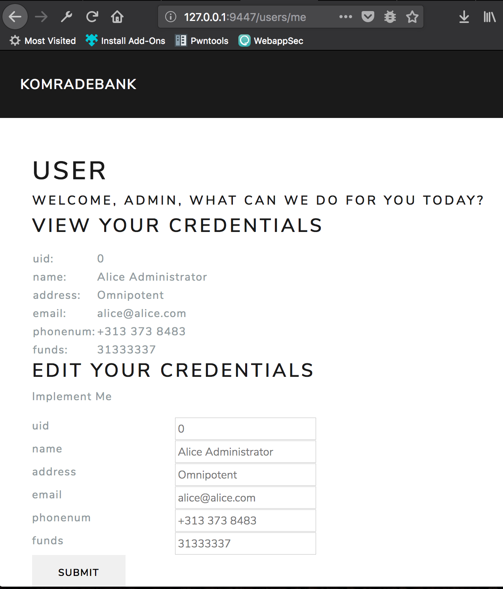
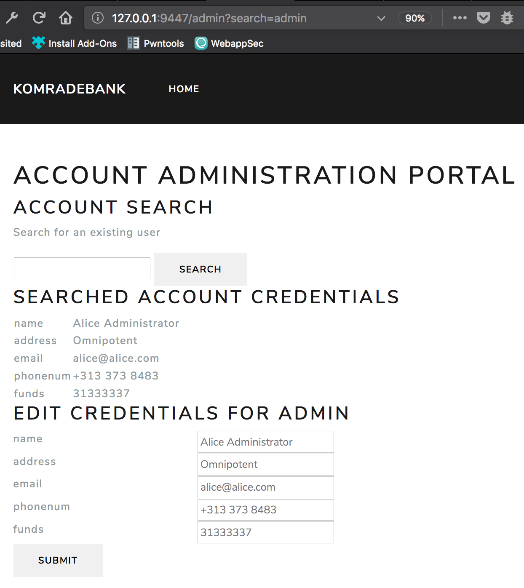
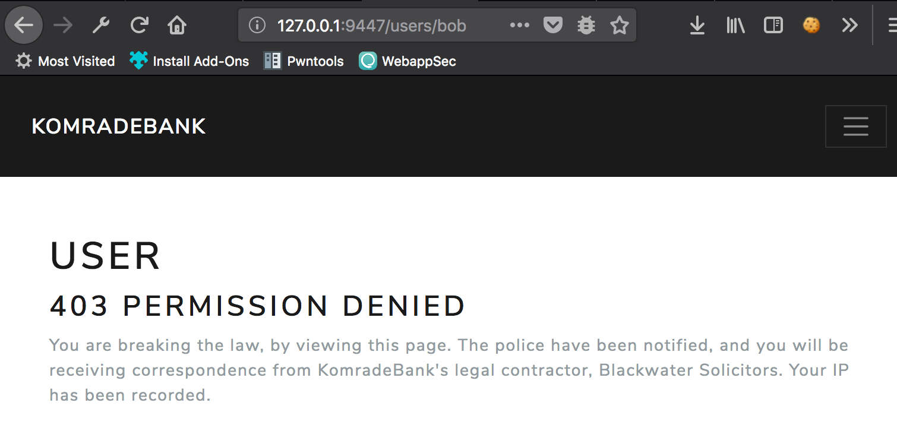

# Build2
## Overview
Since we’ve hit the market, our user base has grown incredibly, with many users transferring their capital into Yipple. However, the viral and explosive growth of our platform has left us unable to manage our users via the database. We need to outsource our credential management to the users. We also need you to implement an Administrative account that can view users accounts and modify their details.

You will focus on two routes in particular:
1. `/admin`
2. `/users/<accounts>`

## What you have currently.
Build2 has the user account and registration system set up for you. It uses sqlite3
backend and a users.db to do this. In addition to this, a credentials database
is available containing the account credentials of users. You should
examine the scripts in `/flaskr/db/` and run the init script to create the databases. You are welcome to extend the database, but do not change what is currently there.

The credentials schema looks like this
1. Account Name
3. Address
2. Email
3. Phone Number
4. Current Account Funds

```sql
CREATE TABLE creds(
	uid INTEGER,
    name TEXT NOT NULL,
    address TEXT NOT NULL,
    email TEXT NOT NULL,
    phonenum TEXT NOT NULL,
    funds INTEGER
);
```

## Setup

You will want to initialise the sqlite3 databases first.

1. `cd db` and then run `initdb.sh`

Then initialiase the rest of the project

1. `virtualenv venv`
2. `source ./venv/bin/activate`
3. `pip install -r requirements.txt`
4. `pip install -e .`

## Running tests

In the root directory run `py.test` to run the tests.

Be warned, the tests will reset the database to a sane state, but if one of the tests fails for you and the state doesnt get reset then your tests which previously passed may start failing. You will have to watch for this.

## What you must build
### User Backend (views.py)
For the route `/users/<account>`, you must show a user their information.
For regular users that are logged into KomradeBank, they must be allowed to view and update their own user credentials. You should display the queried / updated values out to the page as separate entities.

```python
@app.route('/users/<account>')
def users(account):
    username = account

    # TODO: Implement the ability to edit and view credentials for
    # the creds database.
    if request.method == 'GET':
        # TODO: Display credentials if user belongs to current session, or user is admin.
        # Deny access otherwise and display '404 not found' on the page
        response = render_template("users.html", username=username)
    else:
        # TODO: Update The Credentials
        # Two types of users can edit credentials for <account>
        # 1. Regular Users that have sessions == <account>
        # 2. Administrators.
        response = render_template("users.html", username=username)

    return response
```

### User Frontend (users.html)
You must create a template that outputs the user credentials if they are logged in as that user, or are an administrator. Present to them their current details as well as a form to edit their details. Make sure no other user can edit another users details.

```html

User

<h1 class="mt-5">User</h1>


<h5>Welcome, {{ username }}, what can we do for you today?</h5>

<h3>View your Credentials</h3>
<p>Implement Me</p>

<h3>Edit your Credentials</h3>
<p>Implement Me</p>

<h3>Search</h3>
<form method="get">
    <input type="text" name="username"></input>
    <button type="submit" class="btn">Search</button>
</form>

<h3>403 permission denied</h3>
<p>
    You are breaking the law, by viewing this page. The police have been notified,
    and you will be receiving correspondence from KomradeBank's legal contractor,
    Blackwater Solicitors. Your IP has been recorded.
</p>



```

Here are a few dreary representations of what that would look like. We encourage you to be creative with your design, the important thing is that the appropriate database information is output.



Ignore the uid field in the form, it's an older screenshot.


### Administration backend (views.py)
You can use the same users database, but you might need to add a new parameter in order to tell the difference between administrators and regular users.

2. The administration backend must support POST requests
and return the credentials of a searched user. To view

```python
@app.route('/admin')
def admin():
    response = None

    if request.method == 'GET':
        # TODO: Implement and secure the user administration control panel
        # The administration panel must distinguish between users that are administrators
        # as well as regular users.
        # It should also be able to search for a user via a get parameter called user.
        searchedUser = request.args.get('user')
        response = render_template("admin.html", user=searchedUser)

    elif request.method == 'POST':
        # TODO: You must also implement a post method in order update a searched users credentials.
        # It must return a page that denies a regular user
        # access and display '403 permission denied'.
        response = render_template("admin.html")

    return response
```

It will look like this



### Administration frontend (admin.html)
You must create the template for the administration front end.
The administration front end provisions the form for account searching.
After performing a search, the front end exposes the user
credentials from the creds database on the page. It also needs to present a form that updates user credentials in (bar the uid) the creds.db

```html

Login

<h1 class="mt-5">Account Administration Portal</h1>
<!-- TODO: Implement the user account search -->
<div>
    <h3>Account Search</h3>
    <p>Search for an existing user</p>
    <!-- TODO: Implement the user search form-->
    <form></form>
</div>

<!--
TODO: Implement the user results table for their credentials
The table will allow a logged in administrator the ability
to edit and update the credentials of any given KomradeBank account.
-->
<div>
    <h3>Searched Account Credentials</h3>
    
    <table class="table">
        <thead>
            <th>Name</th>
            <th>Address</th>
            <th>Email</th>
            <th>Phone</th>
            <th>Current Funds</th>
        </thead>
        <!-- IMPLEMENT ME -->
        <tbody>
            <tr>
                <td></td>
                <td></td>
                <td></td>
                <td></td>
                <td></td>
            </tr>
        </tbody>
    </table>

    <h3>Edit credentials for {{ user }} </h3>
    <form><!-- IMPLEMENT ME --></form>

    
    <p>Search for a user to edit their credentials</p>
    
</div>

```

When the user is not an admin, or the logged in user searches for another user or even when in doubt, return a 403. Make sure you output the whole '403 permission denied'. Tests will check for it.

